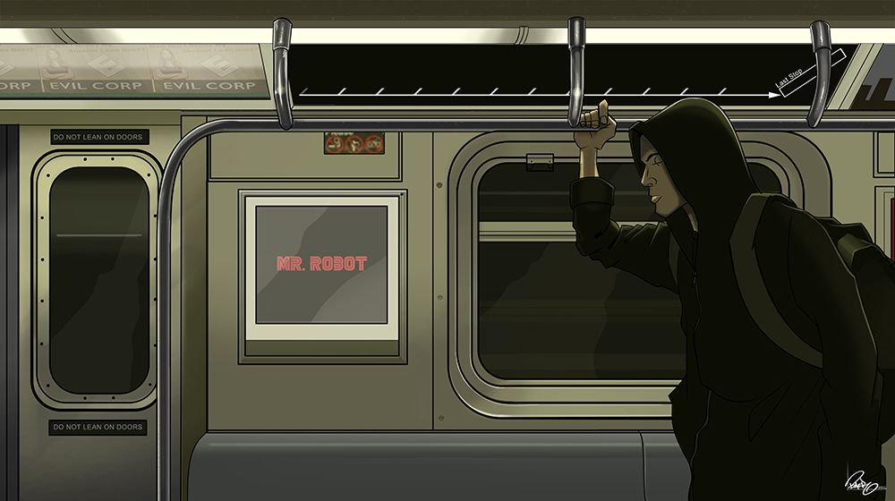

  

---

## 📇 [IDENTITY_CARD]

* **Bio:** I am NZUKOU DAMIEN, an 18-year-old from Cameroon 🇨🇲. I am a chill person, deeply passionate about the underground scene, low-level computing, cybersecurity (specifically CTFs 🖥️), and video game development.
* **Interests:** I am also a big fan of manga, Japanese pop culture, and comics 🍥 🕷️.

---

## 🎛️ [ARSENAL_TECH]

### 🖥️ Programming Languages & Scripts

  

### 🎮 Game Engines & Frameworks

  
  

### 💿 Environments & Operating Systems (Underground & Main)
* **Standard Systems:** Windows, Ubuntu, Void Linux, Alpine Linux, Slax Linux, Archcraft Linux
* **Alternative Kernels & Low-Level OS:** Haiku OS, Menuet OS, Kolibri OS

### ⚔️ Cybersecurity & Pentesting
* **CTF Platforms:** OverTheWire
* **Pentesting Tools:** Nmap

### 🛠️ Development Tools & Editors

  

**Terminal Text Editors:** micro

---

## ⚡ [LOGOUT_NOTE]

> *I have crazy ideas and I will do everything to achieve them... So don't forget to follow my terminal.* 😉

  

